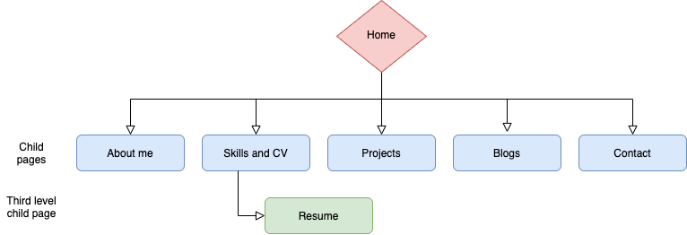
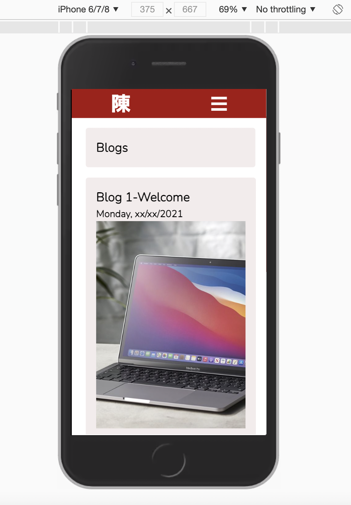
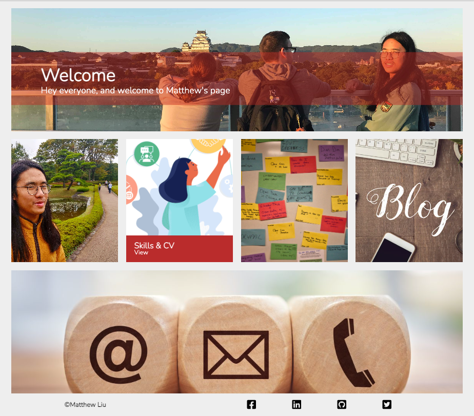
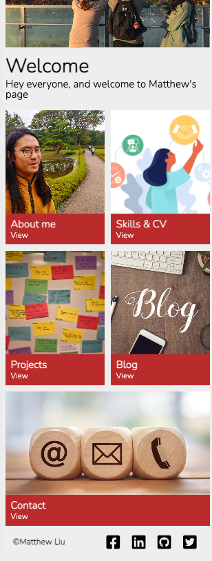
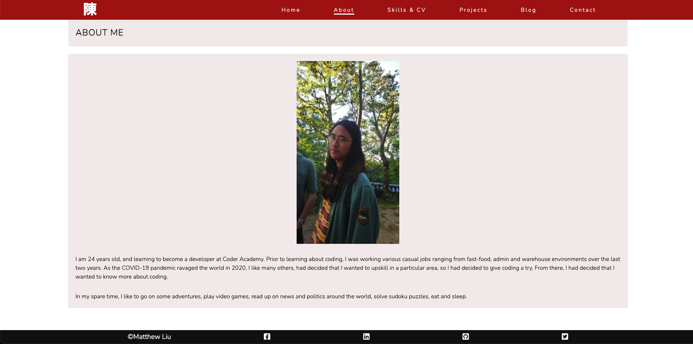
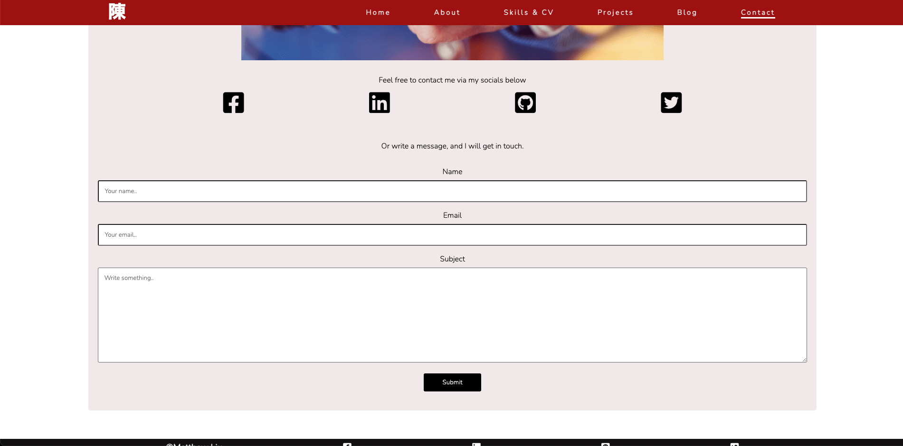
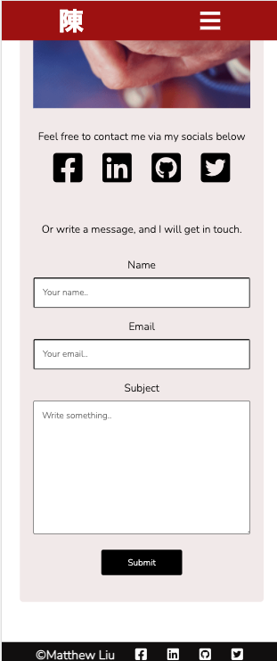
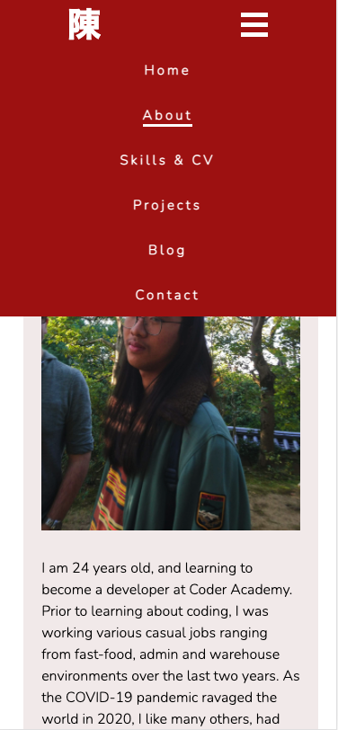
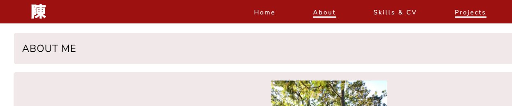

# My first portfolio website
- GitHub repository: https://github.com/hey-chan/TIA2_portfolio
- Portfolio link: https://portfoliositebymatt.netlify.app/

## ***Purpose***
The purpose of this portfolio is to:
- Demonstrate and showcase the skills I have learnt with various tech stacks (eg. HTML, CSS, Git, web deployment)
- Use this as a way to showcase myself, personality, interest and experiences
- A way to connect and reachout to fellow students and developers in the industry

## ***Target audience***
Target audience includes:
- Future employers looking for dev/IT professional
- Other students and teachers
- Industry mentors

## ***Site map***
I have taken a plain approach with regards to the sitemap; simple and easy to navigate. Pages from the home page has access to all children pages, and all children pages and access other child pages and home. 

##  ***Tech stack***
I have made use of:
- HTML for the basic content of the page (images, paragraphs, h1-h6, headers, footers, etc.)
- CSS for creating the overall aesthetic of the page
- Javascript for navigation bar functionality for mobile viewing only

## ***Functionality/Features***

CSS enhances the aesthetic of the page. With CSS, I have made use of some animation and effects, particularly with the homepage (index.html), where I have of the `hover` and `transform` when navigating through the homepage (see image below). This will move the image vertically, and revealing the navigation items that are initially hidden, while still maintaining the overall home page. This feature is only available for desktop viewing. 

On mobile and tablet, I have used media queries to disable this feature as this feature is redundant for these devices. In addition, I have made use of CSS grids in `index.html`, to allow me to better layout the design of the page, and change each grid to my original design

`Hover` is also used on the navigation bar at the top of each child page and the footer bar when hovering over each menu item. A small white underline will be displayed in the navigation menu, and the social media icons down at the footer will be displayed in a red colour when hovering over a particular icon. In addition, I have made use of attributes in CSS that help indicate which page the user is currently on (denoted by a small white underline on each current page).

The navigation bar itself is fixed at the top, using `position: fixed`, and will always be on display when scrolling down a page. Applies to both mobile and desktop viewing.

A functional contact form is also available in `contactme.html` page to allow users to personally contact me. Within the contact form, I have added code within `<form>`, that makes use of service from Formspree, without any potential privacy concerns.

In mobile viewing, a combination of features using Javascript and CSS are used for the dropdown menu. This animation feature will display the menu from the right size after clicking over the burger bars in mobile viewing, which will show all menu items, one after another, in rapid succession.

I have considered the concept of responsive design and mobile first, with the use of media queries (`@media screen`). These will change sizes to accomodate for either desktop, tablet or mobile viewing.

## ***Screenshots***
**Home page**: with `hover` and `transform` 

*****

**Home page-mobile**

*****

**About me page**

*****

**About me-mobile**

*****

**Contact page**: A functional contact form that uses Formspree

*****

**Contact page-mobile**

*****

**Dropdown menu**: Making use of Javascript and CSS 

******

**Navigation bar**: Underlines current page, and shows underline for other item when hovered over

*****

**Footer**: Icons will change colour when hovered over

